# **"Blockchain We Trust"** *by #BrainShock*!
---

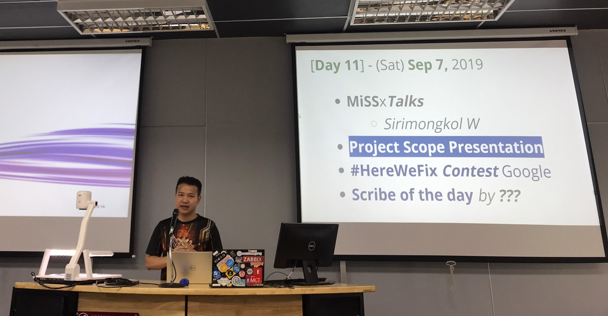

**MUT ALL STAR**

**1. Introduction**

  **What is Blockchain?**
    
   Blockchain เป็นเทคโนโลยีที่มาช่วยในเรื่องของการบันทึกข้อมูลที่เราสามารถจะรับประกันความปลอดภัยได้ว่าจะไม่มีใครมาเปลี่ยนแปลงข้อมูลที่เราได้บันทึกไปก่อนหน้าได้
     เพราะเนื่องจากทุกคนจะมีการแชร์ข้อมูลกันไว้เหมือนเป็นห่วงโซ่ที่ต่อ ๆ กันไป ถ้าจะต้องมีการเปลี่ยนแปลงข้อมูลเกิดขึ้นก็จต้องทำการไปเปลี่ยนข้อมูลที่อยู่ในทุก blockchain
     ซึ่งในกรณีสามารถทำได้ยากมาก
     
  **Procedure of blockchain**
    
   หลักการทำงานของ blockchain คือ ฐานข้อมูลจะถูกแชร์ให้กับทุก Node1 ที่อยู่ในเครือข่ายและการทำงานของเทคโนโลยี Blockchain จะไม่มีเครื่องใดเครื่องหนึ่งเป็นศูนย์กลาง    
   หรือเครื่องแม่ข่าย ซึ่งการทำงานแบบนี้จะไม่ถูกควบคุมโดยคนเดียว แต่จะกระจายข้อมูลออกไปทุกโหนดและจะมีการอัปเดตฐานข้อมูลแบบอัตโนมัติเมื่อมีข้อมูลใหม่เกิดขึ้น
   
  **Contain of blockchain**
      
   ส่วนประกอบของ blockchain จะประกอบไปด้วย 4 ส่วน คือ
   1) Block 2) Chain 3) Consensus 4) Validation
   
**2. Ethereum Wallet**

    - What is Ethereum wallet?
      
      Ethereum wallet เป็นกระเป๋าสตางค์ digital ที่ใช้สำหรับใช้งานในระบบของ blockchain
   
    - Meta Mask wallet tool 
   
      เป็นโปรแกรมที่เป็นส่วนเสริมของ web browser ของ Firefox และ Google chrome โดยเราจะใช้ wallet ผ่านโปรแกรมนี้
      
    - How to register to Meta Mask
    
      1. สร้างพาสเวิร์ดจำนวน 8 ตัวอักษร
      2. ขั้นตอนนี้จะได้ Secret Backup Phrase ให้ทำการ copy เก็บไว้ก่อน
      3. ทำการเรียงลำดับ Seed Phrase โดยให้ตรงกับตำแหน่ง Secret Backup Phrase ที่เราได้รับมา
      
    - How to use Meta Mask
      1. ในโปรแกรม Meta Mask มีทั้งเครือข่ายจริงและเครือข่ายทดลอง
      2. โดยการทดสอบครั้งนี้ใช้เครือข่ายทดลองชื่อ Rinkeby
      3. สามารถหาเหรียญได้จากเว็ป https://faucet.rinkeby.io/
   
**3. Smart contract & Solidity**

  **Smart Contract คืออไร?**
    
ก่อนที่เราจะมาทำความรู้จักกับ Smart Contract กัน จะขอเล่าที่มาที่ไปของ Ethereum กับต้นกำเนิดแนวคิด Smart Contract โดยจะขอยืมบทความจากเวปหนึ่งมาเล่า ซึ่งผมอ่านแล้วเห็นภาพ credits by (https://nuuneoi.com/blog/blog.php?read_id=939) 
    
  **Ethereum กับต้นกำเนิดแนวคิด Smart Contract**

ก่อนจะไปถึงรายละเอียดว่า Smart Contract คืออะไร การเข้าใจแนวคิดว่าทำไมถึงต้องมีสิ่งที่เรียกว่า Smart Contract ด้วยคงจะเป็นการเริ่มต้นที่ดีกว่า ในอดีตยุคที่ Blockchain ถือกำเนิดนั้น โลกมี Application อยู่เพียงตัวเดียวที่ทำงานบน Blockchain และสิ่งนั้นมีชื่อว่า “Bitcoin” 

ถึงวันนี้คำว่า Bitcoin จะดูหรูหราฟู่ฟ่าใครมีแล้วร่ำรวย แต่อย่างไรก็ตาม ถ้าให้พูดถึงฟังก์ชันของ Bitcoin แล้ว ถามว่ามันทำอะไรได้บ้าง ? นั่งคิด 3 วินาทีแล้วก็ตอบ … “ก็โอนหากัน”
มันทำได้แค่นั้นจริง ๆ … (ณ นาที้นั้นจนถึงนาทีนี้นะ อนาคตอีกเรื่อง) 

เจ้าหนู Vitalik ผู้ซึ่งเป็นหนึ่งในทีม Bitcoin Magazine ที่มีชื่อเสียงมากในขณะนั้นก็รู้สึกว่า โอ้วจอร์จ นี่มันอะไรกัน มันช่างไร้สาระเสียชริง Blockchain มันมีประโยชน์มากกว่าแค่โอนหากันไปมานะ
“คงจะดีถ้า Blockchain มีความสามารถในการรันโค้ด บันทึกข้อมูล รวมถึงบันทึกการเปลี่ยนแปลงของข้อมูลลงใน Blockchain ไว้ได้ด้วย”
และสร้าง Blockchain ตัวแรกที่มาพร้อมความสามารถในการรันโค้ดขึ้นมานามว่า Ethereum ครับ ถามว่าโค้ดที่จะรันนั้นอยู่ตรงไหน ? คำตอบคือ มันก็อยู่ใน Blockchain นั่นแหละครับ บันทึกไว้เป็นกระดาษใบนึงและยัดเข้ากล่องไว้ ซึ่งกระดาษใบนี้ทุกคนสามารถเข้าถึงได้ ดูได้ว่าโค้ดนี้เขียนว่ายังไง (เพราะ Blockchain ทุกอย่างต้องเปิดเผย) และไม่สามารถเปลี่ยนแปลงได้ (เพราะโค้ดถูกบันทึกอยู่ใน Blockchain เรียบร้อยแล้ว) 

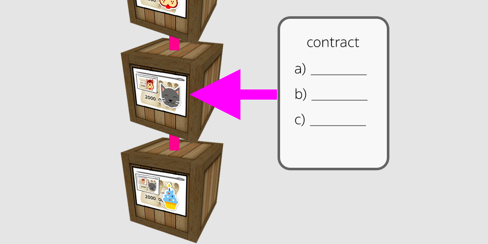

และโค้ดที่ว่านั้นไม่ได้คำสั่งเดียว แต่สามารถมีกี่คำสั่งก็ได้ อย่างเช่นด้านบนก็จะมี a, b, c ซึ่งจะถือว่าเป็นคำสั่งที่แยกกันไปครับ ถ้าให้ดูดี ๆ จากด้านบนจะเห็นว่ามันก็เหมือนกระดาษที่เขียนสัญญาเอาไว้เป็นข้อ ๆ ให้เราเลือกใช้งานได้เลย โดยมีคุณสมบัติว่า 1) มันไม่สามารถเปลี่ยนแปลงได้ 2) ทุกคนสามารถเข้าถึงและดูได้ว่าโค้ดเขียนไว้อย่างไร 3) สามารถสร้างลอจิคการทำงานได้ตามที่ต้องการ 4) สามารถบันทึกข้อมูลที่ต้องการลงใน Blockchain ได้ 5) ข้อมูลที่ถูกบันทึกไว้จะอยู่ตลอดไป หากข้อมูลมีการเปลี่ยนแปลงก็สามารถตรวจสอบได้ เพราะข้อมูลไม่มีทางหายไป ดู ๆ แล้ว มันก็คือสิ่งที่เราเรียกว่า “เอกสารสัญญา (Contract)” ดี ๆ นั่นเองครับ และพอมันอยู่ในรูปแบบที่เราเขียนโค้ดขึ้นมาได้และทำงานบน Blockchain ซึ่งเป็นรูปใหม่ของการทำระบบสัญญา เราเลยเรียกมันว่า “Smart Contract” นั่นเอง 

**หน้าตาของ Smart Contract**

Smart Contract สามารถเขียนได้หลายภาษา โดยอิงตามว่า Blockchain ตัวนั้น ๆ สนับสนุนภาษาอะไรบ้าง อย่างของ Ethereum ก็จะใช้ภาษา Solidity เป็นหลักครับ หน้าตาจะคล้าย ๆ กับ Javascript เป็นภาษาง่าย ๆ เรียนรู้ไม่ยาก อันนี้เป็นตัวอย่างโค้ดจริงแบบเบสิคที่สุดครับ 

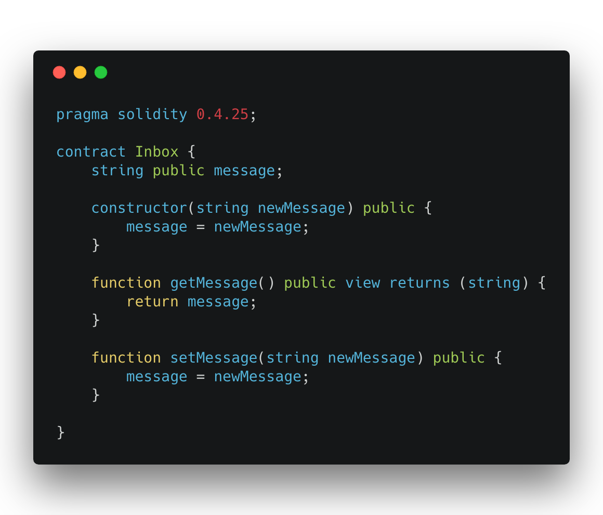

อย่างด้านบนจะเป็นเหมือนกระดาษสัญญาที่ทำอะไรไม่ได้เลยนอกจากเก็บบันทึกข้อมูลเอาไว้ได้ (ในที่นี้คือตัวแปรชื่อ storedData) และหากอยากจะเปลี่ยนก็สามารถเปลี่ยนค่าได้ด้วยการเรียกคำสั่ง set ครับ และถ้าอยากจะอ่านค่ากลับมาก็ใช้คำสั่ง get นั่นเอง ค่อนข้างตรงไปตรงมา

**ทำไมเราถึงต้องเชื่อ Smart Contract ?**

อย่างที่กล่าวไว้ว่า Smart Contract ทำงานบนระบบของ Blockchain อีกทีหนึ่งทำให้มีคุณสมบัติบางอย่างของ Blockchain

* Immutable : เปลี่ยนรูปไม่ได้ ซึ่งหมายความว่าสัญญาไม่สามารถเปลี่ยนแปลงได้และไม่มีใครสามารถเข้าไปแก้ไขหรือทำลายสัญญาได้
* Distributed : สัญญาถูกกระจายออกไปซึ่งหมายความว่าผลลัพธ์ของสัญญาก็จะได้รับการตรวจสอบจากทุกคนในเครือข่าย หากมีผู้ไม่หวังดีทำการเปลี่ยนแปลงผลลัพธ์ก็จะถูกตรวจพบ และทำเครื่องหมายไว้ว่าไม่ถูกต้อง

**Solidity**

  Cedits by (https://medium.com/@thanwa/solidity-blockchain-solidity-101-barcampsk-837d9f271a4a)
  
  Cedits by (https://medium.com/20scoops-cnx/มารู้จักกับ-solidity-ขั้นพื้นฐานกัน-6f713b3fb64)
  
  ความเป็นมา (History)
  
  solidity เป็นภาษาสำหรับการสร้าง Smart Contract เป็นภาษาที่ได้รับอิทธิพลมาจาก C ++, Python และ JavaScript ที่สำคัญเลยก็คือเป็นภาษาชนิดที่ statically typed และเป็นภาษาแบบ Object Oriented (OO) เพราะว่ามีคุณสมบัติของการสืบทอดและการทำ struct เป็นต้น

**ชนิดของตัวแปร (Value Types)**

* Booleans : bool (true and false)

* Integers : int/uint อันนี้เราสามารถกำหนดขนาดที่เราจะใช้ได้โดยมีขนาดตั้งแต่ 8-256 bits เช่น int8 และ uint16 และถ้าหากเราไม่ได้ได้ระบุขนาดของ bits ก็จะมีขนาด 256 โดยอัตโนมัติ เช่น int หรือ uint นั้นหมายความว่ามีค่าเท่ากับ int256 หรือ uint256

* Bytes : bytes มีขนาดตั้งแต่ 1–32 bytes เช่น bytes8 หรือ bytes32แต่ถ้าเราไม่กำหนดขนาดก็จะเป็น array dynamic size

* Strings : string อันนี้ไม่มีให้กำหนดขนาดของ bytes หมายความว่าจะมองเป็น array dynamic size ซึ่งมีความแตกต่างจากการใช้ bytes ที่มีการกำหนดขนาดตรงที่จำนวนของ gas ที่ใช้ strings จะใช้ gas มากว่านิดหน่อย

* Address : address มีค่าอยู่ที่ 20 byte ตามขนาดของ Ethereum address

**Smart contract คือ account ที่ถูกควบคุมโดย code

ซึ่งจะประกอบด้วย 3 ส่วนสำคัญคือ**

   * balance คือ จำนวนของ ether ที่อยู่ใน account นี้
   * storage คือ ข้อมูลที่อยู่ใน smart contract ซึ่งสามารถเก็บข้อมูลได้หลายชนิด เช่น uint, string, array เป็นต้น
   * code คือ machine code สำหรับ account นี้ (ไม่สามารถอ่านแล้วเข้าใจได้โดยง่าย)

Solidity Programming Language

   * เขียนอยู่ในรูปของไฟล์ .sol
   * คล้ายกับ JavaScript
   * แต่เป็นภาษาแบบ Strongly typed
   
   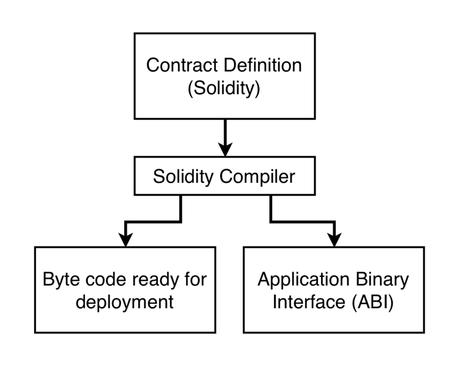
   
   จากรูปแสดงให้เห็นว่าภาษา Solidity เมื่อถูก compile จะได้ output ออกมาเป็น 2 ส่วนซึ่งก็คือ byte code (ส่วนที่เป็น machine code ที่กล่าวถึงก่อนหน้านี้) และ ABI ซึ่งก็คือ interface สำหรับติดต่อกับ Ethereum blockchain ซึ่งใช้ในฝั่งของ client 
   
   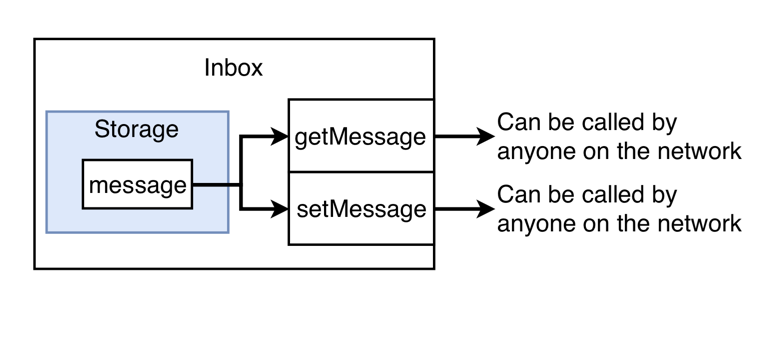
   
   จากโค้ดด้านบน เรามี contract ที่ชื่อว่า Inbox เก็บตัวแปรชื่อว่า message ซึ่งเป็นตัวแปรของ contract มีฟังก์ชัน 2 ฟังก์ชันคือ getMessage และ setMessage ซึ่งทั้ง 2 ฟังก์ชันนี้สามารถเรียกใช้จากภายนอก contract ได้ (เป็นฟังก์ชันแบบ public) 
   
   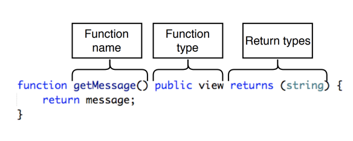

นิยาม Function จะเป็นดังรูปตามตารางข้างล่างนี้

   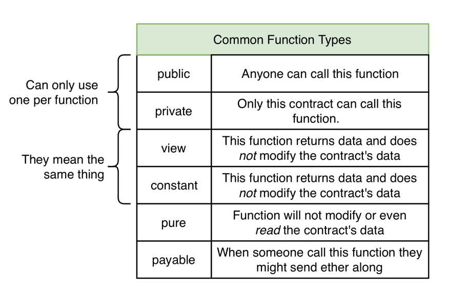
   
* public สามารถเรียกใช้งานจากนอก contract ได้
* private เฉพาะ contract เท่านั้นที่สามารถเรียกได้
* view และ constant เรียกใช้งานแล้วไม่มีการแก้ไขตัวแปรใน contract
* pure ไม่แก้ไขและไม่อ่านตัวแปรของ contract
* payable ผู้เรียกสามารถส่งเงินเป็น ether ขณะเรียกฟังก์ชันนั้นๆ ได้ 

   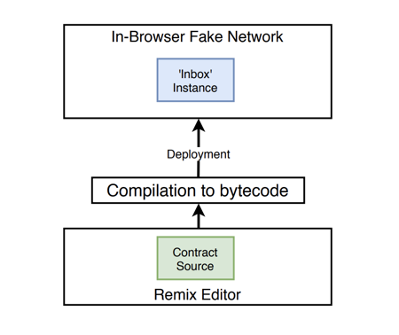
   
   
   
ในการ demo เราจะให้ Remix ซึ่งเป็น online editor ทำการ deploy ลงบน JavaScript VM ซึ่งอยู่ใน browser ซึ่งตัว Remix มีความสามารถในการ compile solidity file ให้เป็น byte code และ ABI อยู่แล้ว ซึ่งอำนวยความสะดวกให้นักพัฒนาได้เป็นอย่างดี

เราจะสังเกตว่า smart contract เมื่อกี้ที่ deploy ไปแล้วจะมีฟังก์ชัน getMessage และ message ออกมา ซึ่งหากลิงคลิกดูแล้วปรากฎว่าให้ผลลัพธ์เดียวกันคือ return ค่าของ message ออกมา ซึ่งหมายความว่าตัวแปรใน contract ทุกตัวที่ประกาศออกมาเป็น public ตัว solidity จะทำการ auto generate ฟังก์ชัน get มาให้เราโดยอัตโนมัติ

   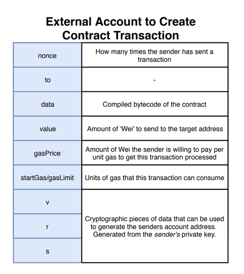
   
การสร้าง smart contract จำเป็นต้องมี external account เป็นคนสร้าง (contract owner) ซึ่งไม่ต้องระบุฟิลด์ to โดย ethereum จะเข้าใจว่ามันคือการ deploy smart contract ใหม่ขึ้นไปบน ethereum blockchain 

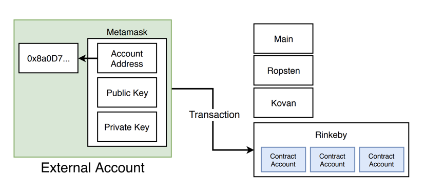

เราสามารถที่จะ deploy ไปยังหลายๆ ethereum network ได้ ซึ่งแต่ละ network ก็จะแยกออกจากกันโดยเด็ดขาด smart contract ไม่สามารถคุยกันข้าม network ได้ แม้กระทั้งการ deploy ไปยัง network เดียวกัน ก็นับว่าเป็นคนละ instance กันสำหรับ contract นั้นๆ (ไม่มีความเกี่ยวข้องกัน) 

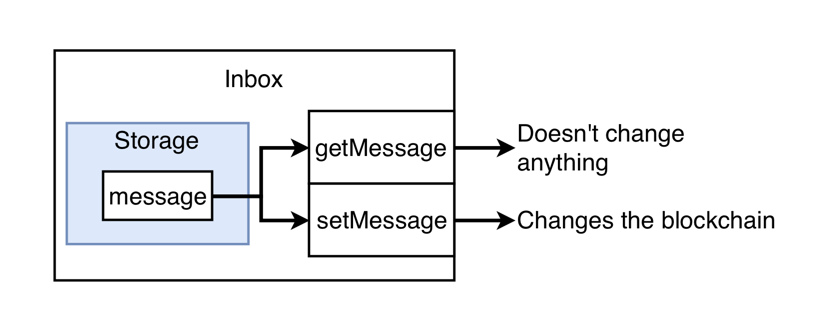

เมื่อเราจะติดต่อกับ smart contract ที่อยู่บน ethereum blockchain หากมีการกระทำที่มีการแก้ไขค่าของตัวแปร จะมีค่าใช้จ่ายเกิดขึ้น เพราะจะมีกระบวนการ PoW ในการ verify ข้อมูลใหม่เกิดขึ้น และจะต้องรอ block time ประมาณ 10–15 วินาที (กรณีที่ใช้งานบน public network)
**การเรียกใช้ฟังก์ชันนั้นมีอยู่สองแบบคือการ call ฟังก์ชันและการ send transaction**

* call function: ใช้สำหรับขอข้อมูลโดยไม่มีการแก้ไขข้อมูลใน ethereum blockchain โดยการเรียกฟังก์ชันประเภทนี้จะไม่มีค่าใช้จ่าย
* send transaction: ใช้เมื่อต้องการแก้ไขข้อมูลใน ethereum blockchain ซึ่งต้องสร้างเป็น transaction และส่งออกไปยัง miner โดยจะใช้เวลาในการ execute (รอ PoW) โดยฟังก์ชันประเภทนี้จะ return transaction hash กลับมา นี่เป็นเหตุผลว่าทำไมเราถึงไม่สามารถ set ค่าตัวแปรพร้อมกับสั่งให้ return ค่ากลับมาได้พร้อมๆ กัน และเมื่อมันเป็นการส่ง transaction มันย่อมจะมีค่าใช้จ่าย 

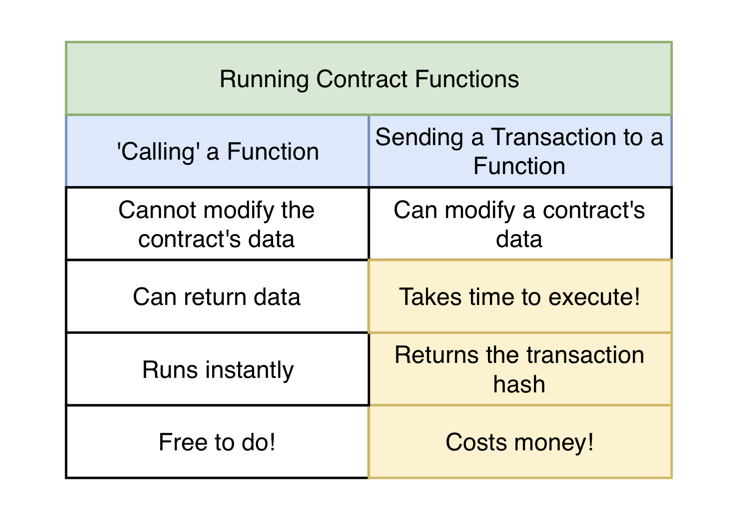

ในการเขียน smart contract หน่วยเงินที่เล็กที่สุดของโลก ethereun คือหน่วย wei (ผมออกเสียงว่าเวย์) โดยภาษานี้จะไม่มีเลขทศนิยม ซึ่งขนาดของตัวแปร uint ที่ใหญ่ที่สุดคือ 256 bit หรือ 32 bytes ซึ่งใหญ่มากเมื่อเทียบกับภาษาอื่นๆ 

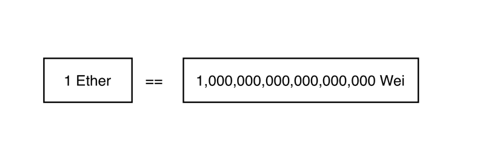

**Gas price และ Gas limit คืออะไร?**

ในการส่ง transaction (deploy ก็ถือว่าเป็นการส่ง transction) จะมีค่าธรรมเนียมที่ต้องจ่าย หรือที่เราเรียกกันว่า gas 

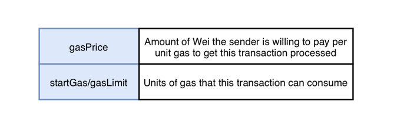

gasPrice คือราคา gas ต่อ 1 unit ซึ่งผู้ส่ง transaction จะเป็นคนจ่ายให้ miner เพื่อให้ miner ทำการ process transaction นั้นๆ โดยราคาของ gas จะแตกต่างกันออกไปตามช่วงเวลาซึ่งขึ้นอยู่กับความหนาแน่นของ ethereum network ในขณะนั้น สามารถตรวจสอบราคา gas ในปัจจุบันได้ที่ https://ethgasstation.info/
สำหรับ gasLimit คือ จำนวนของ gas ที่ลิมิตไว้ในการส่ง transaction เพื่อไม่ให้จำนวน gas ที่ใช้งานมีจำนวนสูงเกินไป ซึ่งอาจทำให้ผู้ส่ง transaction ต้องเสียเงินมากกว่าที่ควรจะเป็น
เราสามารถที่จะคำนวณและประมาณจำนวน gas ที่ใช้งานในการส่ง transaction ได้ โดยสามารถดูได้จากลิงก์ด้านล่างนี้
https://docs.google.com/spreadsheets/d/1n6mRqkBz3iWcOlRem_mO09GtSKEKrAsfO7Frgx18pNU/edit#gid=0

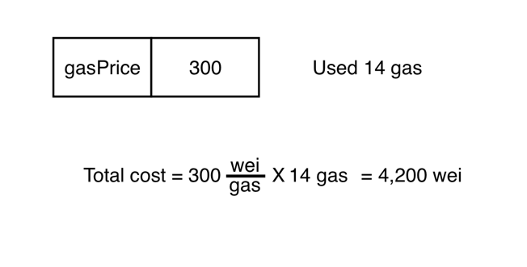

ยกตัวอย่างเช่น ฟังก์ชัน doMath มีการ บวก ลบ คูณ และเช็คว่าค่าทั้งสองมีค่าเท่ากันหรือไม่ หากดูจากตารางจะพบว่า operation ADD ใช้ 3 gas, SUBTRACT ใช้ 3 gas, MULTIPLY ใช้ 5 gas และ EQ ใช้ 3 gas รวมทั้งหมดเป็น 14 gas

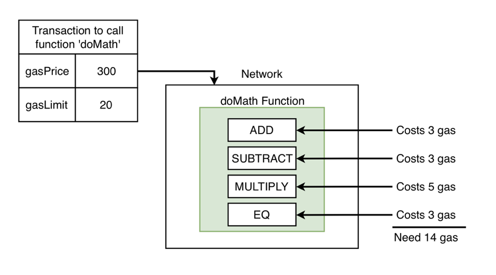

เมื่อเราได้จำนวน gas ทั้งหมดที่ใช้งาน เราสามารถที่จะนำราคา gas ต่อ 1 unit คูณกับจำนวน gas ก็จะได้ราคา gas ที่ต้องจ่ายในการส่ง transaction นั้น (หากการเรียกฟังก์ชันมีการส่ง ether ด้วยจะต้องนำค่า gas มารวมด้วย) ซึ่งในการพัฒนา smart contract ต้องคำนึงถึงค่า gas ที่ user ต้องจ่ายด้วย ทั้งนี้เราสามารถใช้ web3 ในการ estimate ค่า gas ได้โดยไม่ต้องมาคำนวณเอง

**Solidity DEMO**

PrePare

  * MetaMask
  * Solidity Source code: exaple “SimpleVoting.sol”
  * Remix : IDE online
  * Web3 : เรียกใช้ Smart Contract ผ่าน Web3.js
  
**Step By Step**

  1. Open Web browser » https://remix.ethereum.org/ 
  
  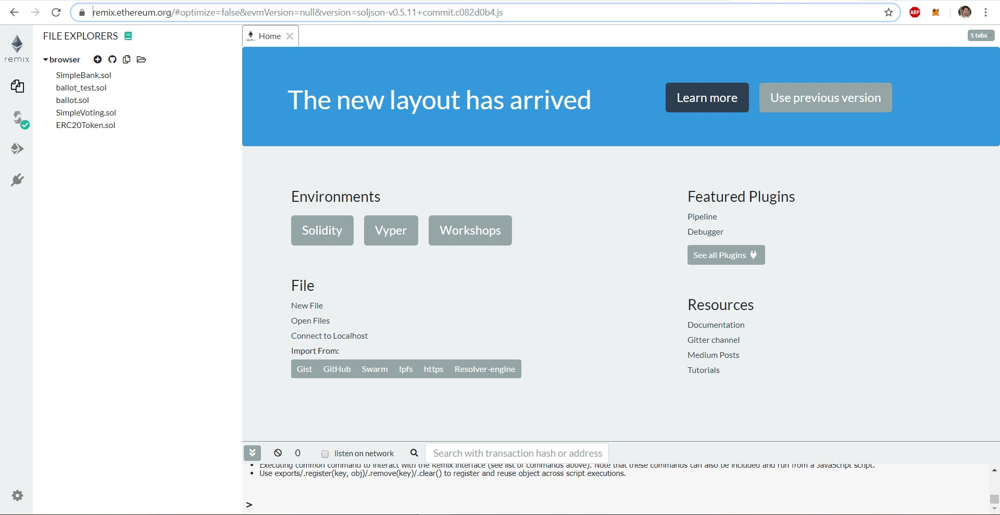

  2. เลือกเมนู File explorers » แล้วกด “Add local file to the Browser Storage Explorer”
 
  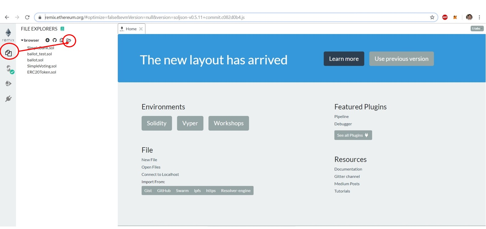
  
  3. เลือก Solidity Source code ที่เป็นนามสกุล *.sol ในที่นี้คือ 
  
  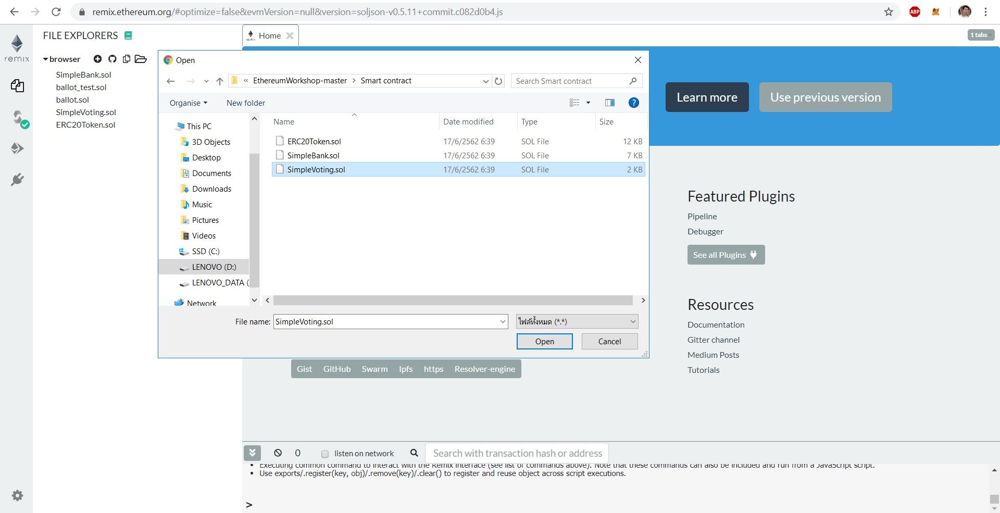
  
  4. จากนั้น เพิ่ม plugin ให้ REMIX เพื่อให้สามารถ Compiler & deploy ได้ 
  
  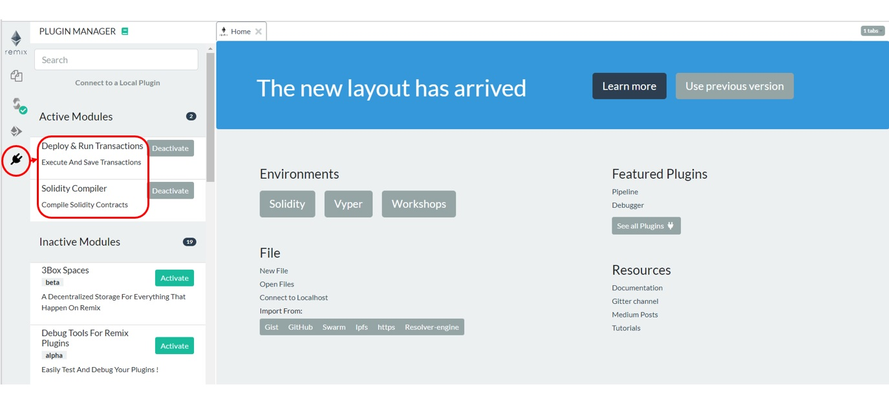
  
  5. เลือก Source code ที่จะ compiler เพื่อให้ได้ ABI กับ Bytecode ซึ่งในขั้นตอนการ Compiler ต้องไม่มี errror
  
  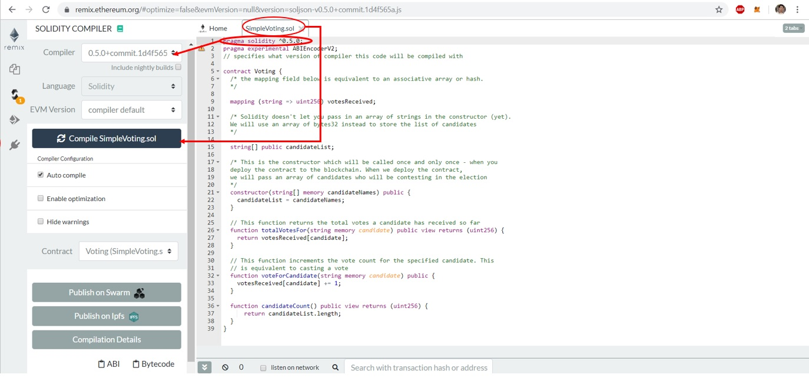
  
  6. การ Run & Deploy

   * login MetaMask
   * เลือก version ให้ตรงกับ code ที่ compiler
   * เลือก code ที่จะ deploy : ตัวอย่างคือ SimpleVoting.sol
   * ใส่ค่า ตัวแปลที่ต้องการ deploy ตามชนิดของ code ที่ประกาศไว้
   
   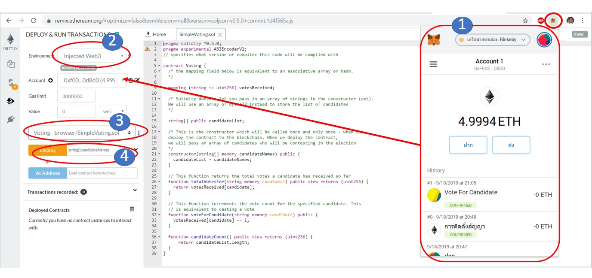

  ใส่ค่า ตัวแปลที่ต้องการ deploy ตามชนิดของ code ที่ประกาศไว้ 
  
  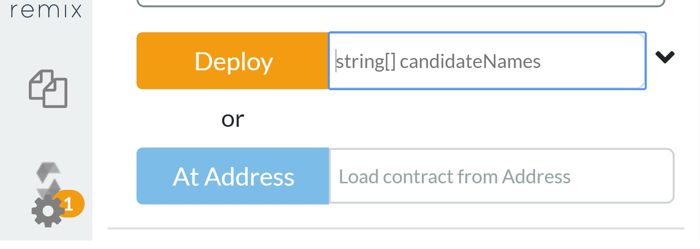
  
  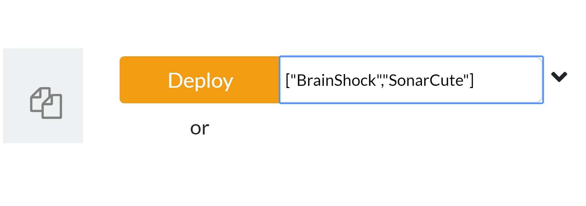
  
  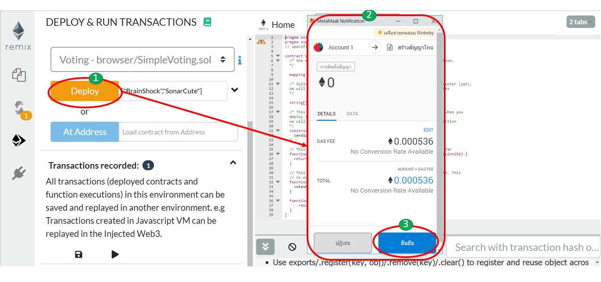

   
**4. Server backend frontend**

    - Front-End Technology 
    
    - Back-End Technology Stack

**5. Demonstation Program**

* **Team Member**

	1. Mutchima Chuensart
	2. Witsanu Sameajang
	3. Yuttapon Kunkot
	4. Pattama Thongprapai
	5. Tossaporn Hansing
	6. Pongpat Rakdej (Blockchain Specialist)
	7. Maykin Warasart (Project Sponsor)
	
---

##### **[Software Security - NEIS0736](../) (2019)**!
