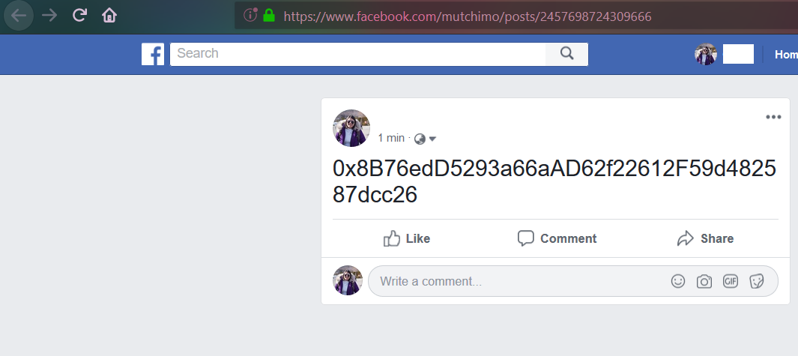

# **"Blockchain We Trust"** *by #BrainShock*!
---

**MUT ALL STAR**

**1. Introduction**

  **What is Blockchain?**
    
   Blockchain เป็นเทคโนโลยีที่มาช่วยในเรื่องของการบันทึกข้อมูลที่เราสามารถจะรับประกันความปลอดภัยได้ว่าจะไม่มีใครมาเปลี่ยนแปลงข้อมูลที่เราได้บันทึกไปก่อนหน้าได้
     เพราะเนื่องจากทุกคนจะมีการแชร์ข้อมูลกันไว้เหมือนเป็นห่วงโซ่ที่ต่อ ๆ กันไป ถ้าจะต้องมีการเปลี่ยนแปลงข้อมูลเกิดขึ้นก็จต้องทำการไปเปลี่ยนข้อมูลที่อยู่ในทุก blockchain
     ซึ่งในกรณีสามารถทำได้ยากมาก
     
  **Procedure of blockchain**
    
   หลักการทำงานของ blockchain คือ ฐานข้อมูลจะถูกแชร์ให้กับทุก Node1 ที่อยู่ในเครือข่ายและการทำงานของเทคโนโลยี Blockchain จะไม่มีเครื่องใดเครื่องหนึ่งเป็นศูนย์กลาง    
   หรือเครื่องแม่ข่าย ซึ่งการทำงานแบบนี้จะไม่ถูกควบคุมโดยคนเดียว แต่จะกระจายข้อมูลออกไปทุกโหนดและจะมีการอัปเดตฐานข้อมูลแบบอัตโนมัติเมื่อมีข้อมูลใหม่เกิดขึ้น
   
  **Contain of blockchain**
      
   ส่วนประกอบของ blockchain จะประกอบไปด้วย 4 ส่วน คือ
   1) Block 2) Chain 3) Consensus 4) Validation
   
**2. Ethereum and MetaMask**

   **Ethereum คืออะไร**
   
   Ethereum (ETH) เป็นหนึ่งในสกุลเงินดิจิทัล (Cypto currency) ที่ใช้เทคโนโลยี Blockchain ทำงานอยู่เบื้องหลัง เช่นเดียวกับอีกหลาย ๆ สกุลเงิน ซึ่งถูกพัฒนาขึ้นโดย Vitalik Buterin เด็กหนุ่มอัจฉริยะชาวรัสเซีย ที่ครั้งหนึ่งเขาเคยอยู่ในทีมพัฒนาของ Bitcoin ก่อนจะแยกตัวออกมาสร้าง Ethereum ในปี 2556
   
   Ethereum และระบบ Blockchain ที่ถูกสร้างออกมาในรูปแบบ token หรือเหรียญคริปโตที่มีจุดประสงค์เอาไว้ใช้เป็นเสมือนเชื้อเพลิงหรือ “gas” สำหรับเติมพลังให้กับ decentralized app ต่างๆที่ถูกสร้างขึ้นด้วย Ethereum โดยเหรียญดังกล่าวนั้นสามารถถูกซื้อ, ขาย หรือเทรด ซึ่งหากจะกล่าวแบบสั้นๆง่ายๆแล้ว เหรียญ Ethereum-based token เหล่านี้ถือกำเนิดมาจาก Blockchain ของ Ethereum ผ่านระบบมาตรฐานการสร้างเหรียญใหม่ของพวกเขาที่มีชื่อว่า ERC-20 
   
   **MetaMask คืออะไร**
      
   MetaMask เป็น Extention Plugin บนเว็บบราวเซอร์ที่ทำงานร่วมกับ Google Chrome , Opera และ Firefox
   
   เมื่อติดตั้งและใช้ Metamask ตอนนี้ เราก็มี Ethereum Wallet ที่ทำงานได้อย่างสมบูรณ์บนตัวเว็บบราวเซอร์ของเรา Metamask สามารถใช้งานและโต้ตอบเนื้อหาทั้งหมดของ ERC-20 และสามารถเพิ่มโทเค็นที่กำหนดเองได้ด้วย
      
   **วิธีการติดตั้งและการใช้งาน MetaMsak**
    
   1. เลือก Extention Plugin จากเว็บบราวเซอร์
   
   
   
   
   
   2. เลือกสร้าง Wallet
   
   
   
   3. ทำการสร้างรหัสผ่านโดยต้องมีจำนวนขั้นต่ำ 8 ตัว
   
   
   
   4. ในขั้นตอนนี้เราจะได้ค่า Secret Backup Phrase (คำซีด) ซึ่งเราต้องทำการ Copy ข้อความเหล่านี้เก็บไว้ด้วย เพื่อจะใช้ในขั้นตอนต่อไป
   
   
   
   
   5. ขั้นตอนนี้เราต้องนำ Secret Backup Phrase ที่เราได้ copy ไว้มาดู เพื่อที่จะเทียบตำแหน่งของคำและเรียงลำดับให้ถูกต้องเพื่อยืนยันตัวตน
   
   
   
   6. หลังจากการยืนยันตัวตนเราจะได้ account มา
   
   
   
   
   7. เราจะได้ค่า address มาเพื่อใช้สำหรับเป็นที่อยู่ในการส่งข้อมูล
   
   
 
   8. ใน MetaMask นั้นจะมีทั้งเครือข่ายจริงและเครือข่ายสำหรับการทดสอบให้เราเลือกใช้ แต่ในที่นี้เราจะเลือกใช้ระบบเครือข่ายทดสอบเรียกว่า Rinkeby
   
   
   
   9. หลังจากผ่านขั้นตอนทั้งหมดมาแล้ว เราจะต้องหาเหรียญมาเพื่อสำหรับใช้งานโดยสามารถหาเหรียญได้จากเว็ป https://faucet.rinkeby.io/
   
   โดยขั้นตอนในการหาเหรียญนั้นต้องเริ่มจาก
   
   9.1 นำเลข Address ของเรานั้นไปโพสต์บน Facebook ของเรา แล้วทำการเปิดเป็น Public
   
   
   
   9.2 ทำการ Copy Link ของโพสต์ที่เราโพสต์ Address ขึ้นไป แล้วนำไปใส่ในช่อง address ของเว็ป https://faucet.rinkeby.io/ แล้วเลือก Give me Ether
   
   
   
   
   9.3 หลังจากขั้นตอน 9.2 สำเร็จจะมีเหรียญเข้ามาที่ address ของเรา
   
   
   
   
**3. Smart contract & Solidity**

  
 

 
 

 
 

 
 

 
 

 
 

 
 

 
 

 
 

 
 

 
 

 
 

 
 

 

# **Solidity DEMO**

---
## **PrePare**
  * MetaMask 
  * Solidity Source code: exaple "SimpleVoting.sol"
  * Remix : IDE online
  * Web3 : เรียกใช้ Smart Contract ผ่าน Web3.js
---

## **Step By Step**
  1. Open Web browser >> https://remix.ethereum.org/
    
  
  2. เลือกเมนู File explorers >> แล้วกด "Add local file to the Browser Storage Explorer"
  

  3. เลือก Solidity Source code ที่เป็นนามสกุล *.sol  ในที่นี้คือ 
    
  
  4. จากนั้น เพิ่ม plugin ให้ REMIX เพื่อให้สามารถ Compiler & deploy ได้
    
  
  5. เลือก Source code ที่จะ compiler เพื่อให้ได้ ABI กับ Bytecode ซึ่งในขั้นตอนการ Compiler ต้องไม่มี errror 
    
  
  6. การ Run & Deploy
  * login MetaMask 
  * เลือก version ให้ตรงกับ code ที่ compiler
  * เลือก code ที่จะ deploy : ตัวอย่างคือ SimpleVoting.sol
  * ใส่ค่า ตัวแปลที่ต้องการ deploy ตามชนิดของ code ที่ประกาศไว้
    
  
  * ใส่ค่า ตัวแปลที่ต้องการ deploy ตามชนิดของ code ที่ประกาศไว้
  
  
  
  
  

* **Team Member**

	1. Mutchima Chuensart
	2. Witsanu Sameajang
	3. Yuttapon Kunkot
	4. Pattama Thongprapai
	5. Tossaporn Hansing
	6. Pongpat Rakdej (Blockchain Specialist)
	7. Maykin Warasart (Project Sponsor)
	
---

##### **[Software Security - NEIS0736](../) (2019)**!
