# **"CI/CD We Can"** *by #SonarCute*!
---

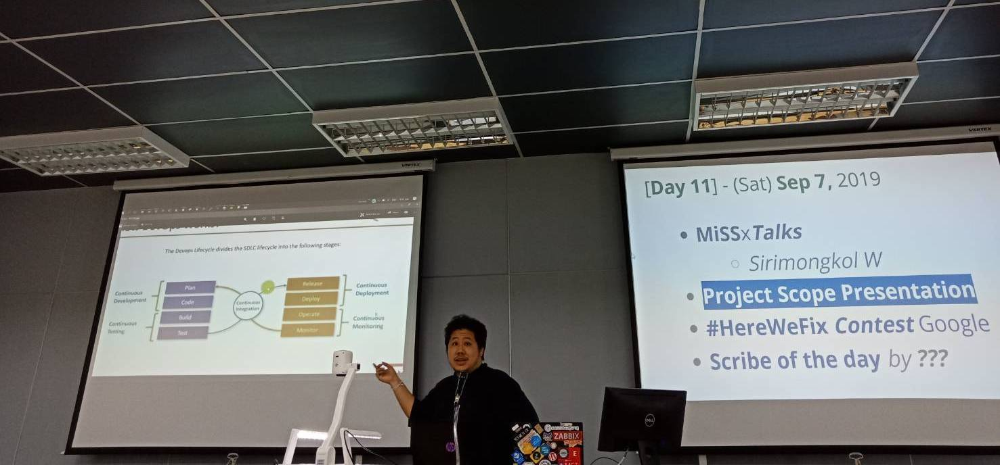

# **CI/CD Process**
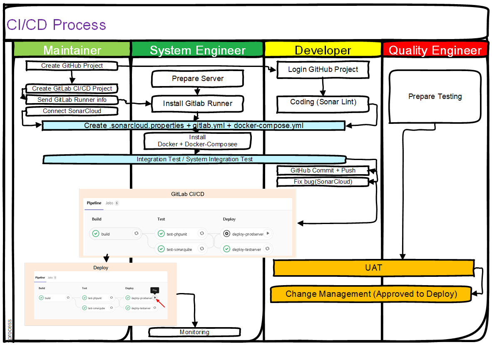

---

## **CI (continuous integration)**

### **Step 1. Create GigHub Project, Create GitLab CI/CD Project, Develop source code**
* **(Maintainer)**

	* Create GitHub Project
		- สร้าง New repository บน GitHub
		- เพิ่ม Collaborators ส่วนของผู้ใช้งานหรือ ที่จะมีสิทธิ์เข้ามาทำอะไรได้บ้าง โดยปกติจะเป็น Dev
	* [Create GitLab CI/CD Project](https://ardnarong.github.io/neis0736-cicd/Using%20GitLab%20CI-CD%20with%20a%20GitHub%20repository/)
		- ทำการเชื่อม gitlab กับ github เพื่อให้ เห็น repo  ที่สร้างไว้แล้ว โดยการ new project>CI/CD for external repo>GitHub
		- เราจะเห็นชื่อ repo ที่สร้างไว้บน GitHub. กด Connectแล้ว Go to Project
		- จะถือว่า GitHub = Repo, GitLab = CI/CD พร้อมใช้งานแล้ว
		- ทำการเตรียม Token ของ GitLab Runner  เพื่อส่งต่อให้กับ Sys Admin นำไปใช้สำหรับลงบน Gitlab Runners onTest Server ต่อไป
* **(Developer)**

	* [login GitHub และใช้ sonar lint ในการพัฒนาซอสโค้ด](https://ardnarong.github.io/neis0736-cicd/Improving%20code%20quality%20with%20SonarQube/)

---

### **Step 2. Send GitLab Runner info, Prepare server and install Gitlab Runner**
* **(Maintainer)**
	* [Send Gitlab Runner info เพื่อให้ system admin ทำการ install Gitlab runner](https://ardnarong.github.io/neis0736-cicd/Maintainer%20send%20GitLab%20runner%20token%20to%20System%20Admin/)

* **(System Engineer)**
	* [Prepare Server and install Gitlab Runner](https://ardnarong.github.io/neis0736-cicd/System%20Admin%20Prepare%20Server/)

---

### **Step 3. Connect GitHub กับ Sonar Cloud**

* **(Maintainer)**
	* [ทำการเชื่อมต่อ GitHub กับ Sonar Cloud](https://ardnarong.github.io/neis0736-cicd/github-and-sonarcloud/)

---

### **Step 4. Discusstion process CI stage (Build, Test, Deploy)**

* **(Maintainer)(System Engineer)(Developer)**
	* Process CI Stage
		- [ใช้ Docker(docker-compose.yml) test (Review code ) ใช้ Sonar Cloud ทั้งหมดทำงานด้วย .gitlac-ci.ymlDeveloper จึง Commit และ push code ที่ทำการแก้ไขแล้วเสร็จจากการตรวจของ Sonar Cloud ไปให้ Gitlab CI/CD project](https://ardnarong.github.io/neis0736-cicd/Improving%20code%20quality%20with%20SonarQube/images/img%20(4).png)

---

### **Step 5. UAT**

* **(Quality Engineer)**
	* ทำ UAT หลังจาก Develop ผ่านการแก้ไขจะเข้าสู่กระบวนการ Change เพื่อทำการ Deploy production
		- Test Case-Add User
			- Preconditons :
				1. ระบบที่เปิดให้บริการ
				2. ข้อมูลของ User ที่จะต้องทำการ Add
			- Aciton : 
				1. Login เข้าสู่ระบบ
				2. เข้าเมนู User
				3. กดปุ่ม “+Add New”
				4. กรอกข้อมูลของ User ที่ต้องทำการ Add
				5. กดปุ่ม “Submit” เพื่อเพิ่ม User
			- Input : 
				1. Full name
				2. Email Address
				3. Default Password
				4. Mobile Number
				5. Role
			- Expected Result :
				1. เพิ่มข้อมูลของ User ที่ต้องการ Add
					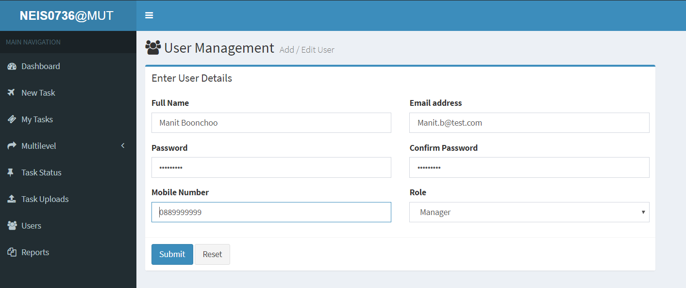
				2. สามารถ Add User ได้โดยไม่เกิด Error
					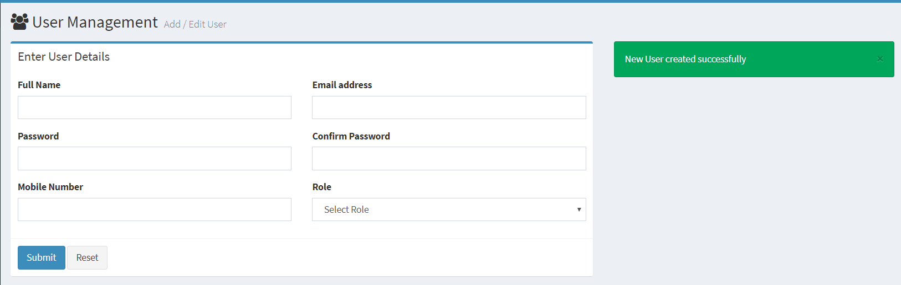
				3. มี User ที่ทำการเพิ่ม อยู่ในระบบ
					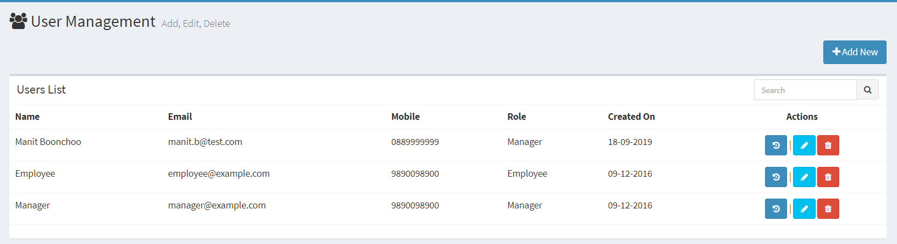

		- Test Case-Delete User
			- Preconditons :
				1. ระบบที่เปิดให้บริการ
				2. User ในระบบ
			- Aciton : 
				1. Login เข้าสู่ระบบ
				2. เข้าเมนู User
				3. เลือก User ที่ต้องการแก้ไขข้อมูล
				4. กดปุ่ม Delete เพื่อลบ User
			- Input : 
				1. User
			- Expected Result :
				1. แสดงข้อความ “Are you sure to delete this user ?” ก่อนทำการลบ User
					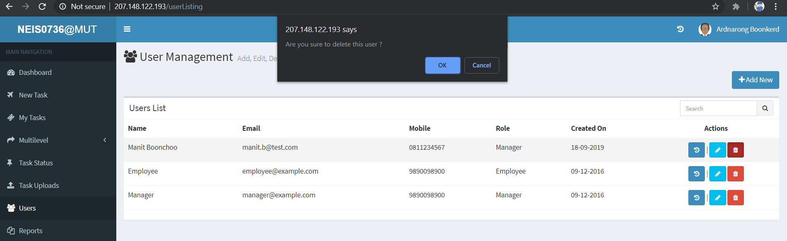
				2. แสดงข้อความ “User successfully deleted” เพื่อให้ทราบว่าทำการลบ User สำเร็จ
					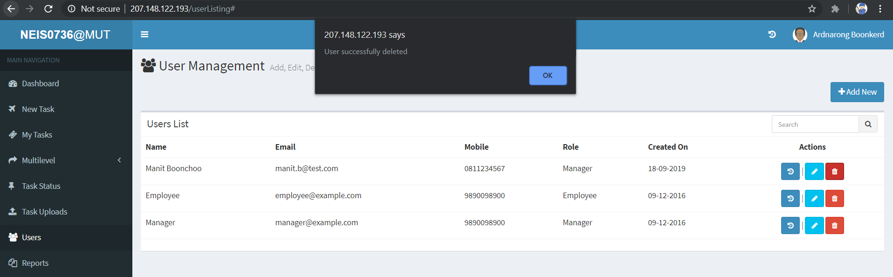
				3. ในระบบไม่มี User ที่ทำการลบไปแล้ว
					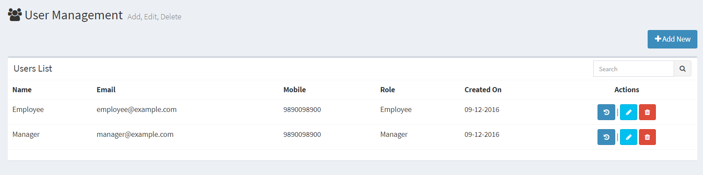
		
		- Test Case-Edit User
		
			- Preconditons :
				1. ระบบที่เปิดให้บริการ
				2. User ในระบบที่จะต้องทำการแก้ไข
				3. ข้อมูลเบอร์โทรศัพท์ใหม่ของ User ที่จะต้องแก้ไข
			- Aciton : 
				1. Login เข้าสู่ระบบ
				2. เข้าเมนู User
				3. เลือก User ทำต้องการแก้ไขข้อมูล
				4. เปลี่ยนข้อมูลเบอร์โทรศัพท์
				5. กดปุ่ม Submit เพื่อแก้ไขข้อมูล
			- Input : 
				1. Mobile Number
			- Expected Result :
				1. แสดงข้อมูล User ก่อนทำการแก้ไขข้อมูล
					
				2. สามารถแก้ไขข้อมูลของ User ได้
					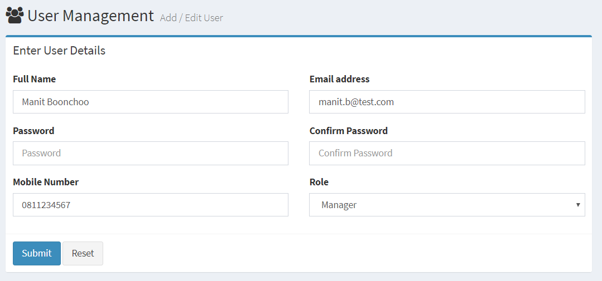
				3. ข้อมูลในระบบมีการเปลี่ยนแปลง
					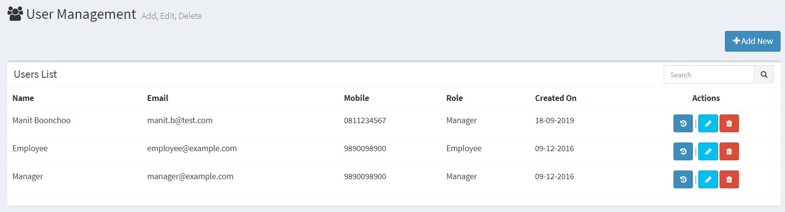
				
		- Test Case-Login Fail
			- Preconditons :
				1. Email Address
				2. Password
			- Aciton : 
				1. กรอก Email Address ผิดในช่อง
				2. กรอก Password ผิดในช่อง
				3. กดปุ่ม Sign In
			- Input : 
				1. Email และ Password
			- Expected Result :
				1. ไม่สามารถเข้าใช้งานได้ พร้อมทั้งมีแจ้งชื่อผู้ใช้งานหรือรหัสผ่านผิด
					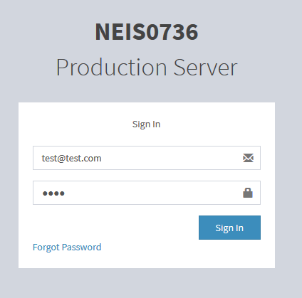
					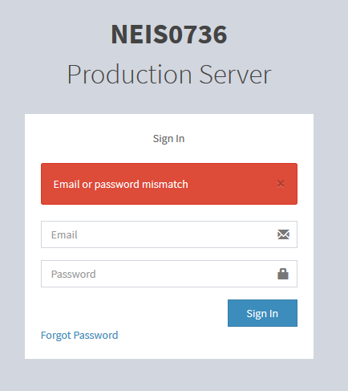
		
		- Test Case-Login Success
			- Preconditons :
				1. Email Address
				2. Password
			- Aciton : 
				1. กรอก Email Address ผิดในช่อง
				2. กรอก Password ผิดในช่อง
				3. กดปุ่ม Sign In
			- Input : 
				1. Email และ Password
			- Expected Result :
				1. สามารถ Login เข้าใช้งานได้สำเร็จ
			- Post Conditions : สามารถเข้าสู่ระบบและใช้งานระบบได้อย่างปรกติ
					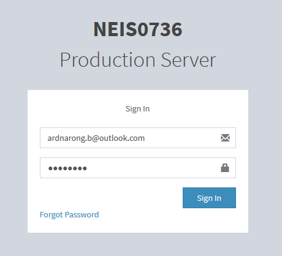
					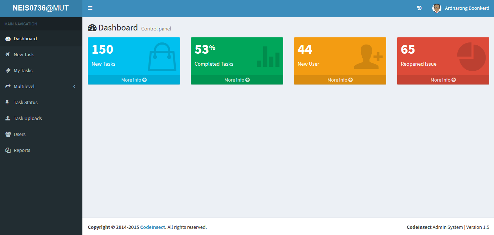

---
# **CD (continuous deployment)**

### **Step 6. Deploy and Monitoring**

* **(System Engineer)**
	* Deploy production 
		- Login GitLab
		- Goto menu CI/CD -> Pipeline
		- On stage deploy prodcutin > Click Play 
		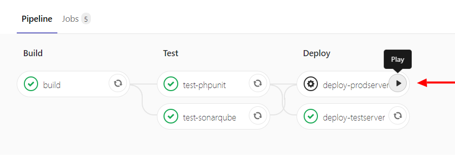
		- System deploy passed 
		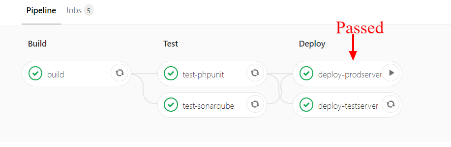
		- Visite website 
		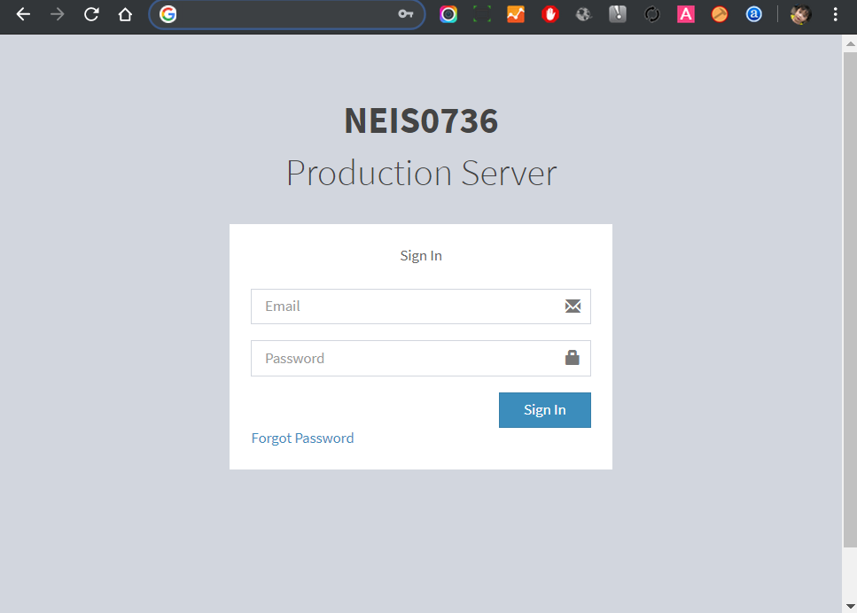
<td align='right'> (Ref.https://ardnarong.github.io/neis0736-cicd/deploy/) </td> 

	
	
	* Monitoring

---

* **Team Member**

	- Ardnarong Boonkerd (Development Leader)
	- Angkarn Pummarin (Project Facilitator)
	- Suparath Suwannakorth (Maintainer)
	- Sirimongkol Wongfu (System Admin)
	- Raksapon Leelachat (System Admin)
	- Pongpat Petchai (Quality Engineer)
	- Tanapad Onsri (Quality Engineer)
	- Maykin Warasart (Project Sponsor)

---

##### **[Software Security - NEIS0736](../) (2019)**!
